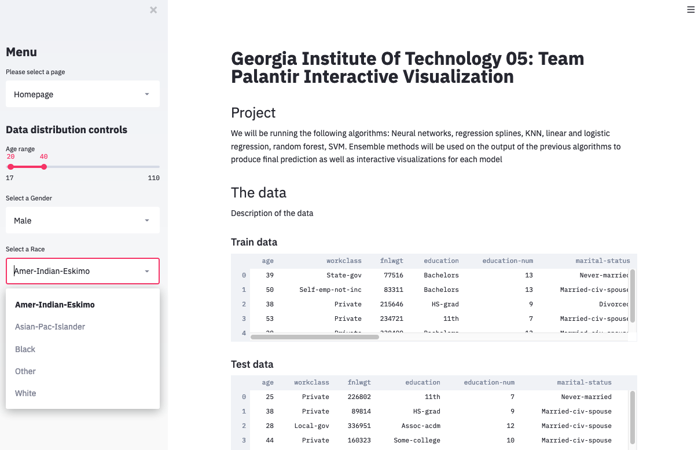
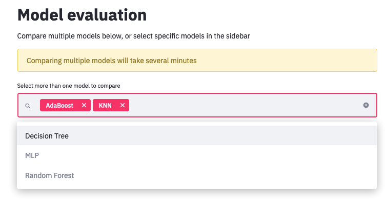
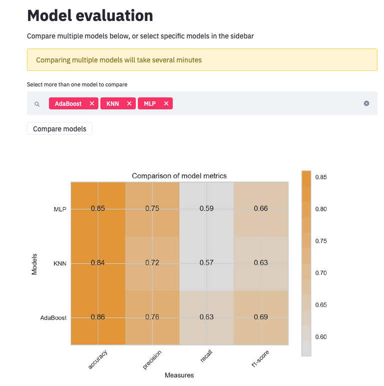
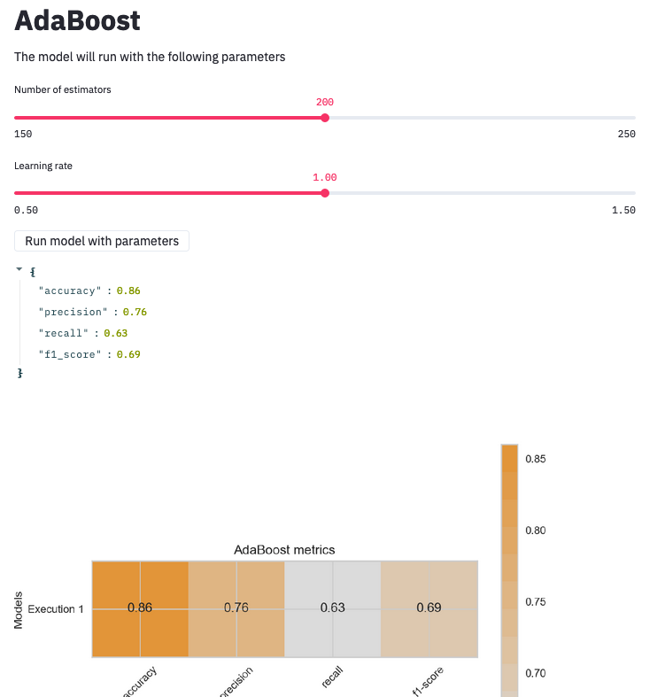

# Machine learning model comparison

## Description
This is a project for OMSCS CSE 6242, in which we tested individual machine learning models and combined ensemble models to determine if an ensemble model consisting of multiple models (AdaBoost) has greater predictive power than individual machine learning models. Example learning models we tested were: K Nearest Neighbors, Random Forest, and Support Vector Machines. We trained and tested our data on 1994 U.S. Census data that contained demographic information such as age and income. We built a dashboard that allows users to select multiple models and/or ensemble models and evaluate the performance of each model based on their accuracy and precision.

To read our project in further detail, take a look at [Final Report](final_report.pdf)
Interactive dashboard not available

#### Tools used
Python, numpy, sklearn, pandas, Streamlit

## Screenshots

Dashboard view of data and filters

Ability to select various models to compare their performance

Evaluate models based on accuracy, precision, recall, t1 score

AdaBoost ensemble model parameters